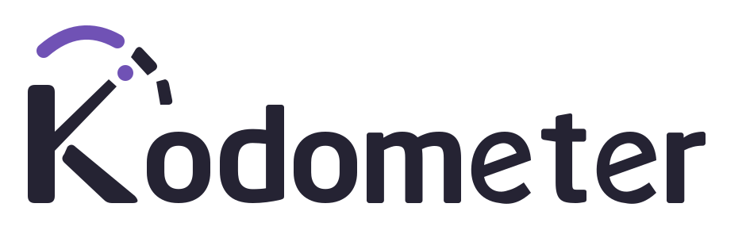

# Kodometer

<picture>
  <source media="(prefers-color-scheme: dark)" srcset="branding/kodometer-brand-pack/logos/kodometer-iris-on-dark.svg">
  
</picture>

[](https://www.conventionalcommits.org/en/v1.0.0/)
[](LICENSE)

Kodometer is a native KDE Plasma 6 widget for monitoring AI-provider usage limits. It follows the compact meter model of [CodexBar](https://github.com/steipete/CodexBar) while using Qt, Plasma controls, keyboard navigation, and system theme colors.

Kodometer talks to provider APIs directly. It does not require CodexBar, invoke provider CLIs, inspect browser sessions, or pass commands through a shell.

## Status

Kodometer targets KDE Plasma 6.4 and newer. Version 0.3.0 adds Soft Iris branding, provider artwork, and optional panel donut meters. Native x64 packages remain available for Arch Linux, Ubuntu 26.04 LTS, and Fedora 43/44, plus source-based AUR recipes. Widget features include:

- a compiled Plasma 6 applet for Wayland and X11;
- native Codex, Claude, DeepSeek, Gemini, Kimi Code, OpenRouter, xAI, and z.ai requests through Qt Network;
- secure loading, atomic OAuth rotation, and KWallet-backed API-key entry;
- session, weekly, model-specific, routines, spend-limit, and Gemini tier windows;
- Claude monthly-cap and plan presentation;
- xAI prepaid balance and 30-day platform spend summaries;
- Kimi Code 7-day and short-window request quotas;
- DeepSeek account balance with paid and granted credit breakdowns;
- z.ai and BigModel CN Coding Plan, MCP, model-token, and account-balance data;
- OpenRouter credit balance, API-key spending cap, and optional 30-day activity totals;
- 7-day and 30-day daily spend charts for xAI and OpenRouter;
- Soft Iris branding, native provider icons, and optional panel donut meters;
- provider tabs, an overview, reset countdowns, and account and plan labels;
- official dashboard and documentation links from provider details;
- per-widget automatic refresh, provider switches, and idle-window preferences;
- named Codex, Claude, and Gemini credential profiles, with only the selected profile polled;
- named DeepSeek, Kimi Code, OpenRouter, xAI, and z.ai accounts in KWallet, with selected-only polling;
- in-widget profile/account selection, including recovery when usage data is unavailable;
- opt-in low-quota desktop notifications with duplicate suppression;
- last-good data retention when a refresh fails;
- redacted account identity by default;
- request timeouts, response-size limits, and manual redirect handling;
- C++ and QML tests with line, function, and branch coverage gates above 95%;
- CI checks for formatting, builds, tests, QML, commits, dependencies, workflows, and leaked secrets.

Codex, Claude, DeepSeek, Gemini, Kimi Code, OpenRouter, xAI, and z.ai are available as native providers. Codex, Claude, and Gemini support named credential profiles; DeepSeek, Kimi Code, OpenRouter, xAI, and z.ai support named KWallet accounts.

## Requirements

Runtime:

- KDE Plasma 6.4 or newer;
- Qt 6.4 or newer, including Qt Quick Controls and Qt Quick Dialogs;
- KDE Frameworks 6 Wallet and Notifications, with a configured KDE Wallet service;
- a Codex login at `~/.codex/auth.json`, or under `$CODEX_HOME/auth.json`;
- a Claude login at `~/.claude/.credentials.json`;
- a Gemini CLI OAuth login at `~/.gemini/oauth_creds.json` or in a selected profile folder;
- a Kimi Code API key exported as `KIMI_CODE_API_KEY`, or a fresh Kimi Code CLI login at `~/.kimi-code/credentials/kimi-code.json`;
- an xAI Management API key and team ID, either in a named KWallet account or exported as `XAI_MANAGEMENT_API_KEY` and `XAI_TEAM_ID`;
- a DeepSeek API key exported as `DEEPSEEK_API_KEY`;
- a z.ai API key in a named KWallet account with its region and scope, or exported as `Z_AI_API_KEY`;
- an OpenRouter API key exported as `OPENROUTER_API_KEY`.

Open the widget's **Configure Kodometer…** action to store DeepSeek, Kimi Code, OpenRouter, xAI, or z.ai API keys in KDE Wallet. Kodometer stores entries in a `Kodometer` folder of the network wallet and never copies wallet values into Plasma configuration. In Default mode, a non-empty environment credential takes precedence over its matching wallet entry. Named DeepSeek, Kimi Code, OpenRouter, xAI, and z.ai accounts instead use only their selected wallet credentials and selectors. On the Credentials page, OpenRouter's Default keys remain separate entries. Default xAI uses `XAI_TEAM_ID`; Default z.ai uses environment settings for region, scope, organization, and project.

Kodometer accepts OAuth credentials written by Codex, Claude, and Gemini CLI. Codex's `OPENAI_API_KEY` file form is also supported. Claude profile roots set through `CLAUDE_CONFIG_DIR` are honored, as is `CLAUDE_SECURESTORAGE_CONFIG_DIR`; relative profile paths resolve from Kodometer's working directory, matching Claude Code's literal-path behavior.

Codex distinguishes Pro from Pro-Lite using the API-reported plan, not quota percentages. Subscription labels omit prices rather than attach hard-coded amounts to selected tiers. When the usage response reports at least one available banked reset, both Codex details and Overview show its count. Kodometer only reads this count; it does not consume resets or make extra requests for them.

Gemini API-key and Vertex AI sessions do not expose the Code Assist OAuth quota endpoint and are not supported by this adapter. Token refresh reads Gemini CLI's public installed-app OAuth values from its installed JavaScript package without running the CLI. `GEMINI_OAUTH_CLIENT_ID` and `GEMINI_OAUTH_CLIENT_SECRET` override discovery; `GEMINI_OAUTH2_JS_PATH` selects a specific `oauth2.js` file. Following Google's June 2026 consumer-tier shutdown, Gemini quota access is limited to Workspace, education, and Code Assist Standard or Enterprise accounts. Individual, Google AI Pro, and Ultra accounts must use Antigravity instead.

xAI support targets developer-platform billing, not Grok or SuperGrok subscription quota. Create a Management API key with billing read access in the [xAI Console](https://console.x.ai), then export it with the team ID shown in the console URL:

```bash
export XAI_MANAGEMENT_API_KEY="..."
export XAI_TEAM_ID="team-id"
```

Kodometer requests the posted prepaid ledger balance and a best-effort 30-day daily USD spend series. A non-authentication history failure does not hide a valid balance. In Default mode, the Management API key can be stored through Kodometer's credential settings while the team ID comes from the process environment. Named xAI accounts store both values together in KWallet.

Kimi support targets [Kimi For Coding](https://www.kimi.com/code), not the separate Moonshot/Kimi Open Platform. Export `KIMI_CODE_API_KEY` for the recommended API-key flow. Without that variable, Kodometer reuses a fresh access token from the official Kimi Code CLI and sends the CLI device identity headers. `KIMI_CODE_HOME` selects a non-default CLI home. Kodometer does not use the stored refresh token or rewrite the credential file; an expired login must be renewed with Kimi Code CLI. In Default mode, if an API key is rejected and a fresh CLI login exists, Kodometer retries once with the CLI credential. Named KWallet accounts never use this fallback. Browser cookies and `KIMI_AUTH_TOKEN` are not used.

Kimi Code's website **Total usage** lane is not currently supported. It comes from a separate subscription endpoint, not the Coding API's weekly and short-window quotas. A compatibility test with a fresh official device-code OAuth login returned Coding usage successfully but received HTTP 401 from the subscription endpoint. Kodometer does not collect website tokens or browser sessions to fill that gap.

DeepSeek support uses the documented account-balance endpoint. Create an API key in the [DeepSeek Platform](https://platform.deepseek.com), then export it before starting Plasma:

```bash
export DEEPSEEK_API_KEY="..."
```

`DEEPSEEK_KEY` is accepted as a compatibility alias. Kodometer shows the funded currency's total, paid, and granted balances, preferring a funded USD row when the API returns more than one currency. It does not inspect DeepSeek browser sessions or call private dashboard usage and cost endpoints. The key can instead be stored through Kodometer's credential settings in KDE Wallet.

z.ai supports named KWallet accounts with an explicit region and scope. Default mode uses the global Coding Plan API unless configured otherwise. For Default, export the API key before starting Plasma:

```bash
export Z_AI_API_KEY="..."
```

For a China-mainland account in Default mode, set `Z_AI_REGION=bigmodel-cn`. That region also accepts `BIGMODEL_API_KEY`, `ZHIPU_API_KEY`, `ZHIPUAI_API_KEY`, or `GLM_API_KEY`. If those variables are absent, Kodometer securely checks `~/.config/bigmodel/api_key` and `~/.config/zhipu/api_key` in that order.

BigModel team usage requires three additional values:

```bash
export Z_AI_USAGE_SCOPE="team"
export Z_AI_BIGMODEL_ORGANIZATION="org-id"
export Z_AI_BIGMODEL_PROJECT="project-id"
```

Kodometer reads Coding Plan and MCP limits first. Hourly and daily model-token summaries are best effort, as is the BigModel CN account balance; failures in those optional requests do not hide valid quota data. Requests use fixed regional endpoints. Kodometer does not inspect browser cookies or accept endpoint overrides from the environment.

OpenRouter support uses the documented credits and key endpoints. Export a standard API key before starting Plasma:

```bash
export OPENROUTER_API_KEY="sk-or-v1-..."
```

Kodometer shows purchased credits, total account usage, remaining balance, API-key spend, and any configured key limit. `OPENROUTER_HTTP_REFERER` and `OPENROUTER_X_TITLE` set the optional application-identification headers. Key metadata is best effort and has a one-second deadline, so a slow or malformed response does not hide a valid credit balance.

For exact spend across the last 30 completed UTC days, export a management credential with Activity read access:

```bash
export OPENROUTER_MANAGEMENT_API_KEY="..."
```

An ordinary OpenRouter API key does not enable Management Activity. For **Default**, save the separate Management key under **Credentials → OpenRouter Management API key**. For a named account, save both keys together on **KWallet accounts**; named accounts never borrow Default credentials. After saving, select the matching account and refresh. **Management API key not configured** means the selected credential set has no Management key; it does not mean the ordinary key or balance is invalid.

Activity requests always use OpenRouter's production endpoint. Their failures remain visible as diagnostics without discarding credits or key-limit data. Kodometer ignores endpoint overrides, browser sessions, and OpenRouter website cookies. Either key can instead be stored through Kodometer's credential settings in KDE Wallet.

Credential files must be regular files owned by the current user. Kodometer rejects symbolic links, files larger than 1 MiB, and files that grant group or other users read or write access. To secure the default files:

```bash
chmod 600 "$HOME/.codex/auth.json" "$HOME/.claude/.credentials.json" \
  "$HOME/.gemini/oauth_creds.json" \
  "$HOME/.kimi-code/credentials/kimi-code.json" \
  "$HOME/.config/bigmodel/api_key" "$HOME/.config/zhipu/api_key"
```

Build requirements:

- CMake 3.24 or newer;
- Ninja;
- a C++20 compiler;
- Extra CMake Modules;
- Qt 6 Core, Gui, Network, QML, Quick Test, and development tools;
- KDE Frameworks 6 Config, CoreAddons, Notifications, and Wallet;
- `dbus-run-session` for isolated notification integration tests;
- libplasma 6.4 or newer (compiled applet support) and Kirigami.

On Arch Linux:

```bash
sudo pacman -S --needed base-devel cmake extra-cmake-modules \
  dbus kconfig kcoreaddons kirigami knotifications kwallet libplasma ninja qt6-declarative
```

## Release packages

The native-package workflow builds x64 packages for Arch Linux, Ubuntu 26.04 LTS, and Fedora 43/44. It also produces source-based AUR recipes. Each distribution builds against its own Qt and KDE libraries; Ubuntu 24.04 and ARM are not targets.

See [native package installation and compatibility](docs/packaging.md) for downloads, checksums, package-manager commands, and AUR availability. Version `v0.1.0` remains archive-only; `v0.2.0` introduces the native formats. No APT or DNF repository is configured.

## Build and install

```bash
git clone https://github.com/kyaulabs/kodometer.git
cd kodometer
cmake --fresh -S . -B build -G Ninja -DCMAKE_BUILD_TYPE=Release \
  -DCMAKE_INSTALL_PREFIX=/usr
cmake --build build
sudo cmake --install build
```

Log out and back in after installation, then add **Kodometer** from the widget browser. This is a compiled plugin, not a ZIP plasmoid; `kpackagetool6` does not install it. CMake records its installed files in `build/install_manifest.txt`.

### User-local installation

Choose the prefix at configuration time, not just at installation time. `--fresh` also removes cached system-path overrides from older builds:

```bash
cmake --fresh -S . -B build-local -G Ninja -DCMAKE_BUILD_TYPE=Release \
  -DCMAKE_INSTALL_PREFIX="$HOME/.local" \
  -DKDE_INSTALL_PLUGINDIR=lib/qt6/plugins
cmake --build build-local
cmake --install build-local
```

Plasma must know where to find that local Qt plugin directory. Create `~/.config/plasma-workspace/env/kodometer.sh` with the following contents, creating the directory if necessary. Make the file executable, then log out and back in:

```sh
#!/bin/sh
export QT_PLUGIN_PATH="$HOME/.local/lib/qt6/plugins${QT_PLUGIN_PATH:+:$QT_PLUGIN_PATH}"
```

Do not keep both local and system copies installed; plugin search order can load an older copy. Normal `/usr` installations use the distribution's Qt plugin path without this export.

### Release archives and upgrades

Release archives contain system-relative paths and are built in rolling Arch Linux CI. They are not portable across arbitrary Qt, KDE Frameworks, libplasma, or glibc versions. Use a matching native package on supported Ubuntu/Fedora releases, or build from source against the distribution's installed development packages. Dependencies are not bundled.

Download the archive and its checksum together from the same GitHub release. Inspect the archive before installing it for all users:

```bash
sha256sum -c kodometer-X.Y.Z-linux-x86_64.tar.gz.sha256
tar -tzf kodometer-X.Y.Z-linux-x86_64.tar.gz
sudo tar -xzf kodometer-X.Y.Z-linux-x86_64.tar.gz -C /
```

The payload is the compiled plugin, the Kodometer application icon, `kodometer.notifyrc`, LICENSE, and README. A checksum detects corruption; it is not an independent publisher signature. Do not install an archive from an untrusted source.

For upgrades, build or download first, then log out before replacing a plugin already loaded by Plasma. Install from a TTY or SSH session and log back in. Use the same installation method and prefix; do not overwrite a distribution-managed package with a manual install. Widget preferences, OAuth files, and KWallet entries are not installation payloads and need no migration for this update.

To uninstall a manual build, review its install manifest and remove only the listed Kodometer files while Plasma is stopped. Remove any local plugin-path export you added. Keep widget preferences and credentials unless you separately intend to delete them; removing the plugin does not remove wallet entries.

## Widget settings

Open **Configure Kodometer… → General** to choose which providers run and how often they refresh. The page scrolls when the window is too short to show all controls.

- **Refresh automatically** is on by default. Kodometer waits five minutes after each completed cycle, including failed cycles, before starting another. Choose an interval from 1 to 1440 minutes. Polling continues while the popup is closed, but requests never overlap.
- Turn automatic refresh off for startup and manual refresh only. Credential changes and provider switches still trigger a refresh; changes during an active cycle queue one follow-up cycle.
- Uncheck a provider to hide its data and errors and skip it on future refreshes. Requests already in progress may finish. KWallet entries and last-good data are retained so the provider can be re-enabled. Disabling all providers stops polling.
- **Show idle quota windows** is off by default. Enable it to include windows marked idle in the overview, provider details, and account summaries.
- **Panel meters** offers **Bars** (default) or **Donut charts**. Both show the most constrained session and weekly remaining quotas across providers, in that order. Rings sit side by side on horizontal panels and stack on vertical panels. Percentages appear inside when space permits. Each donut has its own native Plasma tooltip listing the matching session or weekly quotas by provider. Bar mode uses one tooltip with provider balances or remaining quotas, preferring weekly over session windows. Missing quota is **Not reported**, not zero. Popup quota rows remain bars.
- **Meter accent** defaults to **Kodometer Iris**, using Iris on dark surfaces and Deep Iris on light surfaces. Choose **Desktop accent** to follow your Plasma highlight color. Other controls and surfaces keep your desktop theme. See [artwork integration](branding/README.md).
- In donut mode, **Session donut color** and **Weekly donut color** each have a color picker. **Use meter accent** clears that donut's override. Custom colors are saved per widget through Apply and do not change bar colors; Cancel restores saved choices and Defaults restores inherited accents.

These preferences use Plasma's per-widget configuration and its Apply, Cancel, and Defaults controls. The separate **Credentials** page writes directly to KWallet when you press Save, Replace, or Remove; Cancel does not undo wallet changes. OAuth credentials and API keys are never stored in the general settings file.

## Switch accounts in the widget

Use the **Profile** or **Account** selector in provider details to choose an existing entry. The footer's **Switch account…** action also works from Overview or when no usage data is available. Its provider list includes enabled providers only. Opening the dialog or choosing a provider does not change configuration, open KWallet, or request usage.

Choosing an account saves the selection immediately for this widget. The selection action does not copy credentials, change another widget's selection, or switch a CLI login. Normal OAuth renewal still applies. Selecting the current entry again does not save or refetch. A changed selection uses the normal refresh cycle and clears that provider's old data. While waiting, the provider view stays accessible with a no-usage placeholder, never the previous account's quota or balance.

Unavailable named wallet entries cannot be selected. Use **Open / retry KWallet** to reload them, or explicitly choose **Default** to restore existing credential discovery. Invalid OAuth profile metadata must be repaired in configuration; the switcher does not discard it. Add, replace, or remove entries through **Configure profiles and accounts…**.

Runtime switches do not wait for Apply and are not undone by Cancel in an open settings dialog. Applying older staged settings can replace the runtime selection. Profile and account names are shown as plain text; the switcher never reads saved keys or team identifiers into its choice list.

## OAuth profiles

Open **Configure Kodometer… → OAuth profiles** to add an existing credential folder and a nonsecret name, such as Work. Codex folders must contain `auth.json`; Claude folders must contain `.credentials.json`; Gemini folders must contain `oauth_creds.json`. Use **Browse…** or enter an absolute path, then **Add and select** and **Apply**. Kodometer does not sign in, copy credentials, or change the CLI's active login. Codex's existing API-key file form remains supported.

Gemini reads `settings.json` from the same selected folder when present. API-key and Vertex AI selections remain unsupported; missing settings never cause a lookup in Default's folder. Default restores `~/.gemini/oauth_creds.json` and `~/.gemini/settings.json`. Gemini's public installed-app OAuth client configuration remains shared across profiles, including the `GEMINI_OAUTH_CLIENT_ID`, `GEMINI_OAUTH_CLIENT_SECRET`, and `GEMINI_OAUTH2_JS_PATH` overrides. Settings files are not rewritten. OAuth renewal updates only the request's original credential file, even if another profile is selected while renewal is pending.

Each provider accepts up to eight named profiles plus **Default (environment)**. Default uses the existing environment overrides and standard credential locations. Named profiles override that provider's folder discovery. Names must be unique within a provider and at most 64 characters; paths are limited to 4096 characters. Duplicate named folder paths are rejected after path normalization. Names, paths, generated profile IDs, and selections are stored in per-widget configuration—not tokens or credential contents. Do not put secrets in profile names.

Only the selected profile is refreshed. Applying a selection change clears that provider's displayed data and errors and queues a normal refresh, even with automatic refresh disabled. Existing requests may finish against their original credential file, but their results cannot populate the new selection. Last-good data remains available after failures within the same profile; it is not reused across profile changes, including when switching back. Other enabled providers continue normally.

The page follows Plasma's Apply, Cancel, and Defaults controls. Removing an active profile selects Default without deleting any credential files. Invalid stored profile configuration pauses Codex, Claude, and Gemini rather than silently using another account; restore Defaults to recover. File ownership, permissions, size, and type are still checked before credentials are used. Normal OAuth renewal may update the selected credential file atomically. Existing Codex/Claude profile documents remain valid; Gemini starts at Default until a named profile is selected.

## Named KWallet accounts

Open **Configure Kodometer… → KWallet accounts** to add a DeepSeek, Kimi Code, OpenRouter, xAI, or z.ai account name and API key, then choose **Add account** and **Apply**. Each provider supports up to eight named accounts. Names must be unique within the provider and contain 1–64 characters. Keys must be nonempty printable ASCII without internal whitespace and at most 64 KiB. Do not put secrets in names.

xAI accounts require a Management API key with billing read access and its team ID. Team IDs contain 1–256 ASCII letters, digits, underscores, or hyphens; enter the identifier, not the full console URL. **Replace key and team** requires re-entering both values. Named xAI accounts never borrow an environment key or team ID. Changing only the team clears old balances, history, and pending results. Team IDs stay in KWallet, not Plasma preferences or notification text.

z.ai accounts require an API key and explicit **Global** or **BigModel CN** region and **Personal** or **Team** scope. Team scope also requires organization and project IDs, each containing 1–256 ASCII letters, digits, underscores, or hyphens. **Replace key and settings** requires re-entering the key and choosing all selectors again; saved values are not filled into the form. Personal scope removes team selectors. Named accounts never borrow environment keys, aliases, selectors, or CN credential files. Changing any selector clears old quota and balance data and rejects pending results. Organization/project IDs stay in KWallet; public regional labels remain visible in provider details.

OpenRouter accounts require an ordinary API key and accept an optional Management key from the same account for Activity. Both keys are saved together. **Replace selected keys** requires re-entering the ordinary key and the desired Management key; leaving Management blank removes it and disables Activity. Kodometer never borrows a missing named Management key from Default or the environment. Activity failures still preserve valid credits. Optional HTTP referer and client-title headers remain application-level environment settings.

Named accounts use only the selected KWallet keys. They ignore environment keys, DeepSeek's compatibility alias, and Kimi's CLI credentials. **Default** restores the existing environment/wallet precedence and Kimi CLI discovery. Only the selected account is polled; applying a selection clears that provider's old data and queues a normal refresh, even with automatic refresh disabled.

Account names, keys, and provider selectors are stored together in KWallet and shared by widgets using that wallet. Saves, key replacements, and removals take effect immediately; Cancel does not undo them. Each widget stores only its selected account UUIDs in Plasma configuration. Selections made in settings follow Apply/Cancel/Defaults; in-widget switches save immediately. Defaults does not delete wallet entries. The entry fields never reveal saved keys.

A locked or unreadable wallet, malformed account data, or a removed selection pauses providers using named accounts rather than silently choosing another credential. Existing requests may finish, but results from changed keys, selectors, or selections are discarded. Unlock the wallet and press the widget's **Refresh** button to reconnect; use **Open / retry KWallet** in settings to reload its account list. Repair malformed named entries with KWallet Manager. Removing an account leaves affected widgets paused until another account or Default is explicitly selected. Label-only edits and changes to unselected accounts do not refetch; replacing a selected key clears its retained data.

### Wallet recovery

The widget's **Refresh** action and **Open / retry KWallet** reload both Default credentials and named accounts. An already-ready wallet is reread without another open request. A failed or malformed Default-credential read clears its cached keys and readiness; a later wallet update or manual retry can recover them. Valid named accounts remain usable when only Default entries are unreadable. Existing environment precedence and Default discovery rules are unchanged.

Closing the wallet clears both registries. Late read replies and abandoned open completions cannot restore closed-wallet keys or overwrite a newer read. A key write may succeed before its follow-up read fails; retry the wallet and check its state before repeating the write. Automatic polling does not reopen a closed wallet.

## Cost history

Provider details show **Daily spend (USD)** when xAI or OpenRouter returns daily history. Choose 7 or 30 days; the range selector changes only the view and does not fetch data or persist a preference. Click a bar, or focus it with Tab and press Space, to read that day's amount. Hover and keyboard focus also expose date-and-amount tooltips.

The chart uses UTC calendar days anchored to the snapshot. xAI includes the incomplete day when the refresh started; OpenRouter ends on the preceding completed day. Refreshes keep one date window even if their requests cross midnight. Retained snapshots keep their original dates rather than sliding forward with the clock.

Only explicitly reported daily amounts contribute to the chart's total. Missing days say **Not reported**, not `$0.00`; a positive amount below one cent says **<$0.01**. Partial history, unreported days, incomplete days, and provider estimates have visible notes. Provider-level partial and estimated flags apply to both ranges. Daily sums can differ from other billing figures, which may cover different periods or scopes.

The chart uses existing adapter results—no extra requests, credential access, billing-data files, or Qt Charts dependency. Invalid history hides the chart without hiding valid balances. Providers that expose only balances or quota do not get a synthetic spend history.

## Quota notifications

Notifications are off by default. Enable **Notify when quota is low** in General settings and choose a threshold from 1% to 50% remaining; the default is 10%.

A fresh successful result at or below the threshold produces one alert for that provider. Kodometer uses its most constrained non-idle quota window, including reported spending caps. Balance-only data, failed refreshes, retained snapshots, and invalid percentages do not generate alerts. Invalid active windows also cannot prove recovery.

A provider is rearmed after its valid active quotas recover to at least five percentage points above the threshold. At the default threshold, quota must recover to 15% before another drop to 10% can alert. Results with no usable quota do not rearm the provider. This state is per provider, per widget session; restarting the widget, toggling notifications, or changing the threshold clears it. Settings changes wait for a fresh result rather than replaying cached data. Changing an OAuth profile or selected KWallet account, replacing its key, or losing access to it clears suppression only for that provider. A fresh low result can alert again, including after switching back or unlocking the wallet. Profile names, account names, and paths never enter notification text.

Alerts contain only a public provider name and the remaining percentage—not account identities, window labels, or credentials. KDE Notifications delivers normal-urgency popups under your desktop notification and Do Not Disturb settings. Delivery is best effort; Kodometer does not retry suppressed or undelivered alerts. The default event has no sound or actions.

## Provider actions

Provider details include **Open dashboard** and **Documentation** buttons. They open official pages in your default browser only when clicked. Hover over a button to preview its destination. If the desktop cannot launch the page, Kodometer shows an error without changing the usage snapshot.

Destinations are fixed in the C++ action catalog. Provider response URLs, account IDs, API keys, and OAuth tokens never enter the links. z.ai uses its global or BigModel CN destinations according to the normalized region of the displayed snapshot; unknown regions have no actions. Gemini opens Google Cloud Console rather than the unsupported consumer Gemini dashboard. BigModel CN opens the console home so you can choose the appropriate personal or team view.

Your browser may ask you to sign in. Kodometer does not read the browser session or import credentials from it. These links do not change provider authentication or refresh behavior.

## Development

Build and run all tests:

```bash
cmake -S . -B build -G Ninja -DBUILD_TESTING=ON -DCMAKE_BUILD_TYPE=Debug
cmake --build build
cmake --build build --target org.kyaulabs.kodometer_qmllint
ctest --test-dir build --output-on-failure
```

Run repository checks:

```bash
scripts/check-format.sh
shellcheck scripts/*.sh
python3 -m unittest discover -s tests -p 'test_*.py'
scripts/coverage.sh
```

The coverage command scans only its freshly instrumented build directory, writes reports to `coverage/`, and fails below 96% for line, function, or branch coverage. QML primitives and general settings controls run through Qt Quick Test in an offscreen session. Applet-enabled builds also test the compiled configuration resources, KConfig persistence, and idle-window presentation without opening a wallet or calling provider APIs. Notification delivery tests run against a fake service on a private D-Bus session, never the desktop's notification service.

Build the legacy Arch-style archive and checksum locally (x64 only):

```bash
scripts/package.sh
```

## Release flow

Development follows Git Flow and Conventional Commits.

1. Merge feature and fix branches into `develop`.
2. Create `release/X.Y.Z` from `develop`, match versions in `CMakeLists.txt`, `applet/metadata.json`, and `package.json`, and add release notes under `docs/releases/`.
3. Open the release pull request against `main`. Wait for green CI and approval, then merge with a merge commit.
4. After merge, the release workflow validates the version and merge SHA and builds the complete native package matrix. It pushes annotated tag `vX.Y.Z`, uploads draft assets, and downloads and verifies every payload and checksum before publishing.
5. The workflow opens or reuses a `main` to `develop` back-merge pull request with the `KYAULABS_BOT_TOKEN` repository secret. Published assets are never replaced on retry.
6. When explicitly enabled and configured, a separate job updates AUR recipes with a GPG-signed commit after GitHub publication. A failed AUR update can be retried without replacing GitHub assets.

See [the release runbook](docs/releasing.md) for preflight checks and recovery, and [the 0.3.0 overview](docs/releases/0.3.0.md) for the latest features, packages, and compatibility limits.

## Security and privacy

Kodometer reads OAuth credentials only from the expected Codex, Claude, Gemini, and Kimi Code authentication files. It rejects symbolic links, unexpected ownership, permissive file modes, non-regular files, and files larger than 1 MiB. OAuth refreshes are written with `QSaveFile` so replacement is atomic and permissions remain owner-only. Claude refresh-token rotation and Gemini access-token renewal are persisted to their provider-owned files so the provider tools and Kodometer share the current token state. Kimi Code credentials remain read-only; Kodometer creates only a missing owner-only device ID required by the official API. Manually entered API keys are held by KDE Wallet, not plaintext Plasma configuration. Non-empty API-key environment values retain precedence over corresponding Default KWallet entries. Explicit named DeepSeek, Kimi Code, OpenRouter, xAI, and z.ai accounts bypass that discovery and have no credential fallback. BigModel CN and Zhipu key files are read-only inputs.

Network requests use fixed provider endpoints, bounded response buffers, explicit timeouts, and disabled automatic redirects. Account email addresses are redacted before data reaches QML. Tokens are never added to the presentation model or logs.

Report vulnerabilities according to [SECURITY.md](SECURITY.md).

## Attribution

Kodometer is an independent Linux client inspired by Peter Steinberger's MIT-licensed [CodexBar](https://github.com/steipete/CodexBar). CodexBar and provider names and marks belong to their respective owners.

## License

Kodometer is licensed under the [GNU Affero General Public License v3.0](LICENSE).
